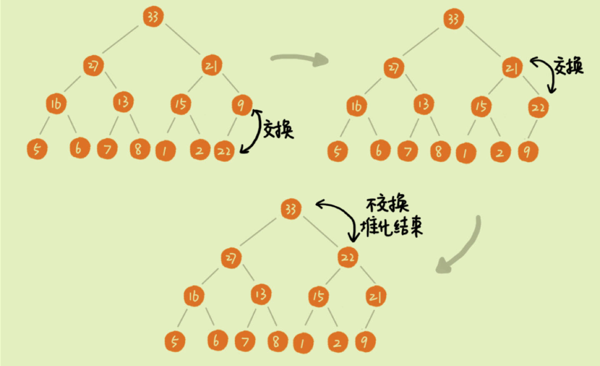
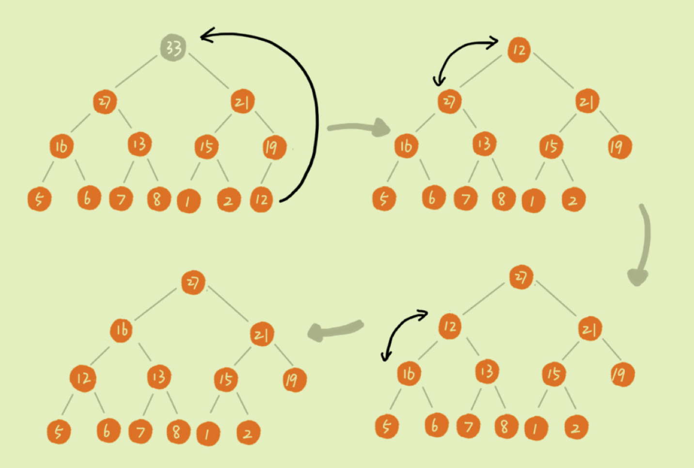

# Heap(max and min heap)
A head is a binary tree satisfy the following condition:
* The heap is a **complete binary tree**
* The value of each node in the heap must be greater than or equal to (or less than or equal to) the value of each node in the child tree.


## Representation of Heap
**Complete binary trees** are best stored in **arrays**. Using arrays to store complete binary trees is very storage efficient. Because we don't need to store Pointers to the left and right children, we can find the left and right children and parents of a node simply by using the index of the array.


## Max Implementation
A Heap should contain the following API
* initialization with an array
* insert an element from the heap
* delete an element for the top(the greatest or the smallest)

Let's take the max heap as an example:

### Insert



The corresponding code: 
```js
export class MaxHeap {
  constructor() {
    this._heap = [null]
  }
  insert(n) {
    this._heap.push(n)
    this.swim(this._heap.length - 1)
  }
  swim(k) {
    let i
    while (k > 1 && this.less(Math.floor(k / 2), k)) {
      // moveUp
      i = Math.floor(k / 2)
      if (this._heap[i] < this._heap[k]) {
        this.swap(i, k)
      }
      k = i
    }
  }
  less(a, b) {
    return this._heap[a] < this._heap[b]
  }
  swap(a, b) {
    let temp = this._heap[a]
    this._heap[a] = this._heap[b]
    this._heap[b] = temp
  }
}
```
### DelMax




```js
export class MaxHeap {
  // same as above ...
  delMax() {
    let max = this._heap[1]
    // to avoid holes in the array, so we move swap the the first(greateset) element and last
    this.swap(1, this._heap.length - 1)
    // remove the last
    this._heap.pop()
    // heapify
    this.sink(1)
    return max
  }
  sink(k) {
    while (2 * k < this._heap.length - 1) {
      let j = 2 * k
      if (j < this._heap.length && this.less(j, j + 1)) j++
      if (!this.less(k, j)) break
      this.swap(k, j)
      k = j
    }
  }
}

```

The whole code can be found [Here](../src/data-structure/Heap.js)