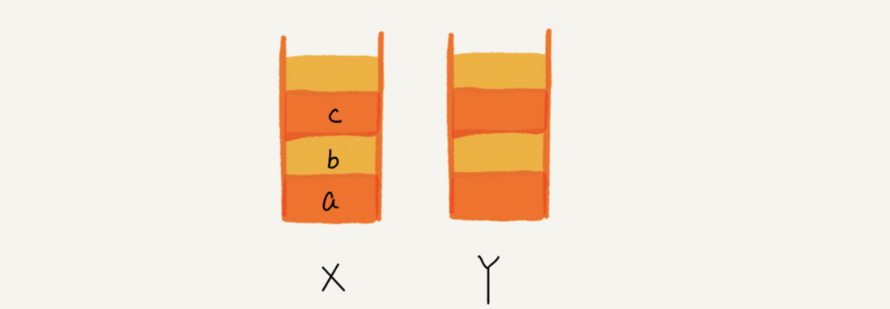
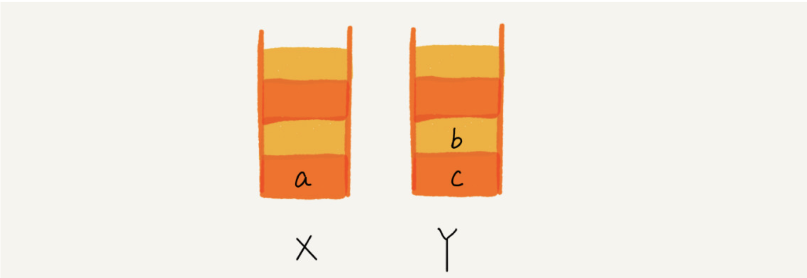
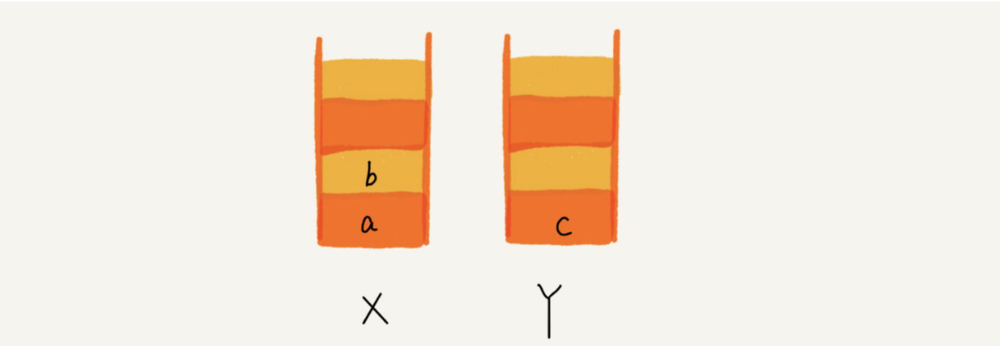

# stack

The stack is known as a last-in, first-out (LIFO) data structure.

## Implementation

In fact, stacks can be implemented using either arrays or linked lists. When the Stacks are implemented with arrays, we call them **sequential stacks**, and when stacks are implemented with lists, we call them **chained stacks**.


```js
class Stack {
  constructor() {
    this.dataStore = []
    this.top = 0
  }
  push(element) {
    this.dataStore[this.top++] = element
  }
  pop() {
    if (this.top === 0) return null
    return this.dataStore[--this.top]
  }
  peek() {
    return this.dataStore[this.top - 1]
  }
  clear() {
    // no need to worry about the old val, any new val that comes in will overwrite the old one
    this.top = 0
  }
  get length() {
    return this.top
  }
}

export default Stack
```

check [here](../src/data-structure/stack.js) to run the code
### Common Usage

### 1. Simulating recursive processes

##### eg1: factorial function

Suppose we have the following expression

> 5! = 5 * 4 * 3 * 2 * 1 = 120

Here is a recursive function to compute the factorial of any number:
```js
// recursion
function factorial(n) {
  if (n === 0) {
    return 1
  } else {
    return n * factorial(n - 1)
  }
}

// use stack to simulate
function fact(n) {
  var s = new Stack()
  while (n > 1) {
    s.push(n--)
  }
  var product = 1
  while (s.length() > 0) {
    product *= s.pop()
  }
  return product
}
console.log(factorial(5)) // displays 120 
console.log(fact(5)); // displays 120
```

##### eg2: binary tree

TODO
## 2. Expression evaluation


## 3. Bracket matching


## 4. Redo && Undo
We can use `stack` to implement the forward && backward functions in the browser

We use two stacks, x and y. We push the first page viewed onto `stack x`, and when the back button is clicked, we push the page off `stack x` in turn, and push the data to `stack y` in turn. When we click the Forward button, we take the data from `stack y` and put it on `stack x` in turn. When there is no data in `stack x`, there is no page to go back to. When there is no data in `stack y`, there is no page to browse by clicking the Forward button. 

For example, if you viewed pages a,b and c in order, we will push page operation a, b and c into the stack in turn. At this time, the data of the two stacks will look like this:



When you go from page c to page a via the backward button, we pop c and b off` stack x `and onto `stack y` in turn. At this point, the data for both stacks will look like this


Now you want to see page b again, so you click the forward button to go back to page b, and we will remove b from `stack y` and put it on `stack x`. The data for the two stacks now looks like the following: 


At this time, you navigate from page b to a new page d, page c can not be repeated through the forward and back buttons, so you need to clear `stack y`. The data for the two stacks looks like the following: 
