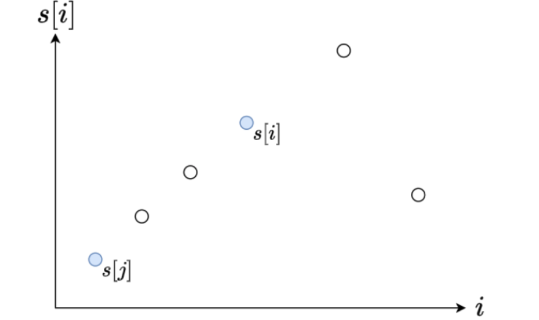
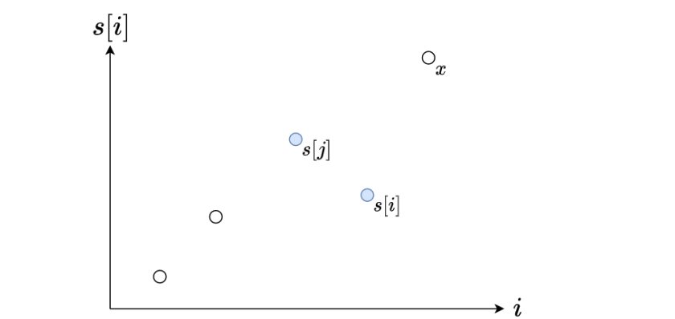

# 862

## Why two-pointers fail
> When we have a negative element in our array, the two-pointers fail!

[Check here](https://leetcode.com/problems/shortest-subarray-with-sum-at-least-k/solutions/2496042/c-why-two-pointers-fail-deque-approach/)


##  Pre-Sum + Monotonic queue

```js
var shortestSubarray = function(nums, k) {
  const n = nums.length
  const preSumArr = new Array(n + 1).fill(0)
  for (let i = 0; i < n; i++) {
    preSumArr[i + 1] = preSumArr[i] + nums[i]
  }
  let res = n + 1
  const queue = []
  for (let i = 0; i <= n; i++) {
    const curSum = preSumArr[i]
    // optimization-1
    while (queue.length > 0 && curSum - preSumArr[queue[0]] >= k) {
      res = Math.min(res, i - queue.shift())
    }
    // optimization-2
    while (queue.length > 0 && preSumArr[queue[queue.length - 1]] >= curSum) {
      queue.pop()
    }
    queue.push(i)
  }
  return res < n + 1 ? res : -1
}

```
Some explanations of opimization1 and opimization2:

**Optimization 1:**

> if **s[i] - s[j] >= k**, then we can use **j** as the left pointer to find a sub-array whose length is shorter than **i-j**, so we can remove **j** from the array



**optimization 2**

> if **s[i] < s[j]**, if we could find a number **x** to meet our needs, namely **x - s[j] >=k** , then we could definitely get **x - s[j] >= k**



## Refercence
* [data-structure-monotonic-queue](https://jojozhuang.github.io/algorithm/data-structure-monotonic-queue/)
* [shortest-subarray-with-sum-at-least-k](https://leetcode.cn/problems/shortest-subarray-with-sum-at-least-k/solutions/1925036/liang-zhang-tu-miao-dong-dan-diao-dui-li-9fvh/)

